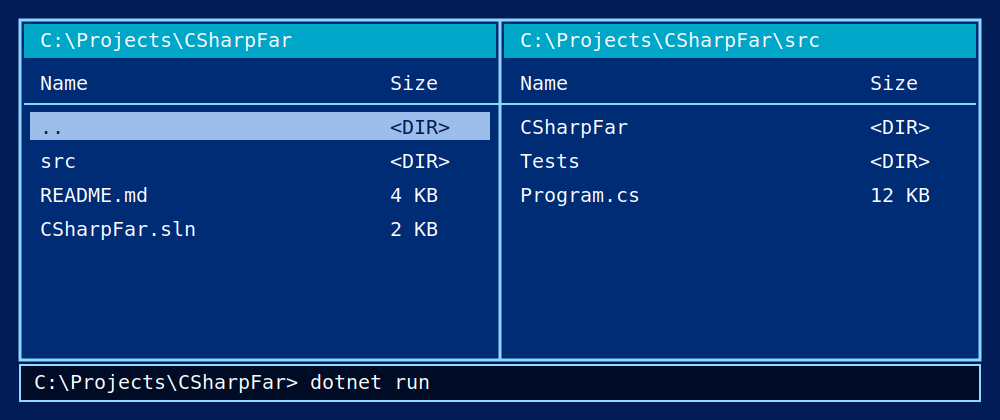

# CSharpFar

CSharpFar is an experimental file manager written in C#.

The goal is simple: rebuild the familiar Far Manager experience in a modern C# codebase, then improve it where modern tooling and LLM-assisted development make that practical.



<!--
Replace the generated preview with real application screenshots when they are ready, for example:


-->

## Why

Far Manager is fast, keyboard-friendly and works well as a shell-oriented file manager. CSharpFar keeps that direction, but uses C# and .NET as the implementation base.

The project is not only about copying the old UI. The interesting part is to keep the speed and predictability of a classic two-panel file manager while making the codebase easier to extend, test and evolve with modern development tools.

## Direction

CSharpFar is expected to grow around a few core ideas:

- a Far-like two-panel console interface;
- fast keyboard-first file navigation;
- common file operations such as copy, move, delete, view and edit;
- command-line usage with command history;
- Windows file opening through system file associations;
- mouse support where it helps, without turning the app into a GUI clone;
- configurable visual modes and palettes.

## LLM-assisted development

This repository uses a worklog-driven development process.

The `.worklog` directory is used to keep task notes, decisions, experiments and implementation history. This gives LLM coding tools enough project context to continue work without treating every request as a fresh one.

The methodology will be described in a separate article later. After publication, the link should be added here.

## Viewer

`F3` opens a full-screen viewer for the selected file.

The viewer uses one streaming path for small and large files. It reads fixed-size byte
blocks by offset and keeps only a small LRU cache, so opening a log does not require
loading the whole file first.

Text-looking files open as text. Binary-looking files open as a 16-byte-per-row hex dump.
Press `F4` or `H` to switch the current file between text and hex.

The viewer supports:

- `Home` and `End` for start/end navigation;
- `Up`, `Down`, `PageUp`, and `PageDown`;
- fast page scrolling with `Alt+PageUp` and `Alt+PageDown`;
- horizontal scrolling with `Left` and `Right`, plus `Ctrl+Left` and `Ctrl+Right` for
  larger horizontal steps;
- `Ctrl+Shift+Left` and `Ctrl+Shift+Right` for the start/end of the current screen line;
- `G` or `Alt+F8` for a line number, byte offset, or percent jump, for example `12000`
  or `85%`;
- `F` follow mode for files that keep growing;
- `F2` for line wrap and `Shift+F2` for word/character wrap mode;
- `F4` or `H` for text/hex display mode;
- `F7` to find text; in hex mode the same dialog can search a hex byte sequence;
- `Shift+F7` or `Space` to repeat search forward, and `Alt+F7` to search backward;
- `Ctrl+U` to clear the current search highlight;
- `Ctrl+C` or `Ctrl+Insert` to copy the current search match;
- `F8` to cycle UTF-8, CP866, and Windows-1251;
- `Shift+F8` to choose automatic detection, UTF-8, UTF-16, Windows ANSI, Windows-1251,
  Windows-1252 or CP866 for the current viewer session.
- `F6` to open the current local file in the built-in editor;
- `+` and `-` to open the next or previous regular file from the panel list;
- `F3`, `F10`, or `Esc` to close the viewer.

Text decoding detects UTF-8 and UTF-16 BOMs, tries UTF-8 without a BOM, and falls back to
the current Windows ANSI code page. The same bounded-sample detector is used by the viewer,
content search and the editor/Quick View reader. Damaged byte sequences are shown with
replacement characters instead of closing the viewer. Control characters from file content
are replaced before drawing, so escape sequences and similar bytes are shown as inert text
instead of being sent to the console as controls.

Quick View (`Ctrl+Q`) is still a bounded preview. It does not try to stream or scroll large
files.

## Compare folders

The Commands menu includes `Compare folders` and `Compare file sets`.

`Compare folders` compares the active panel directory with the passive panel
directory by relative path. `Compare file sets` ignores folder structure and
matches files by file name, file name plus size, or file name plus content hash.

Fast comparison uses size and modified time. Content comparison reads files byte
by byte in chunks. File-set content-hash matching uses streaming SHA-256.
Duplicate file-set matches are shown as ambiguous instead of being silently
paired.

## File operations

### Reliable copy

When copying files, the copy dialog has a `Reliable` copy mode.

If a destination file already exists and is shorter than the source, for example after an interrupted copy, CSharpFar does the following:

1. Compares the tail of the existing destination bytes against the same region of the source.
2. If the tail matches, copying resumes from that offset. No data already on disk is rewritten.
3. If the tail is corrupted, the overlap is rolled back to the last confirmed good position, then copying continues from there.
4. If the destination cannot be matched to the source at all (unrelated file, wrong size), the normal conflict dialog is shown so the user decides.

This mode is for large copies interrupted by power loss, network drops or process termination. Equal-size and larger destination files are not resumed automatically.

## Status

Early development.

The current focus is to build the core user experience first: navigation, panels, shell-like behavior and the visual style that makes the application feel close to Far Manager.

## Build

Requirements:

- .NET SDK
- Windows terminal environment

From the repository root:

```bash
dotnet build
```

Run instructions may change while the project structure is still evolving.

## Install on Ubuntu/Debian

```bash
curl -fsSL https://dimonsmart.github.io/CSharpFar/install.sh | sh
```

Currently the APT package is published for amd64 only.

Verify:

```bash
csharpfar --version
```

Run diagnostics if needed:

```bash
csharpfar --self-test
```

### Manual APT installation

```bash
sudo install -m 0755 -d /etc/apt/keyrings
```

```bash
curl -fsSL https://dimonsmart.github.io/CSharpFar/apt/csharpfar-archive-keyring.gpg | sudo tee /etc/apt/keyrings/csharpfar.gpg > /dev/null
```

```bash
echo "deb [arch=$(dpkg --print-architecture) signed-by=/etc/apt/keyrings/csharpfar.gpg] https://dimonsmart.github.io/CSharpFar/apt stable main" | sudo tee /etc/apt/sources.list.d/csharpfar.list > /dev/null
```

```bash
sudo apt update
```

```bash
sudo apt install csharpfar
```

## Contributing

This is an experimental project, so the best contributions are practical and specific:

- bug reports with clear reproduction steps;
- screenshots of visual differences from Far Manager;
- small focused pull requests;
- ideas that preserve the keyboard-first workflow.

Before large changes, create or update a worklog entry so the decision history stays readable.

## License

See the repository license file.
