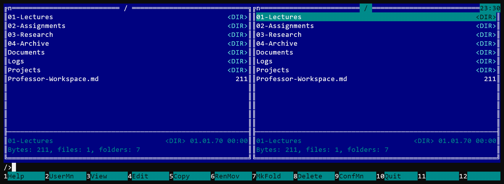

# CSharpFar

**A modern, cross-platform, Far-inspired file manager built with C# and .NET.**

CSharpFar brings the fast, keyboard-first two-panel workflow of classic file managers to a modern C# codebase, with a built-in viewer and editor, powerful file operations, remote file systems, native plugins, mouse interaction, and support for Windows, Linux, and macOS.

[](docs/demo.md)

The demo runs against an [isolated in-memory file system](docs/demo.md) built from the repository-owned fixture.

## Why CSharpFar?

Some workflows are simply faster with two panels, a keyboard, and immediate access to files, commands, viewers and editors.

CSharpFar keeps that style of interaction while rebuilding the application around modern .NET, explicit platform abstractions and a terminal UI engine designed for a real file manager rather than a demo application.

It is inspired by Far Manager, but it is not intended to be a line-by-line clone. The goal is to preserve the speed and predictability of the classic workflow while making the codebase easier to extend, test and evolve.

## Highlights

- Classic two-panel, keyboard-first file management.
- Built-in streaming text/hex viewer for large files.
- Built-in text editor with Unicode-aware interaction and syntax highlighting.
- Search, folder comparison and file-set comparison.
- Resumable, corruption-aware reliable copy mode for interrupted transfers.
- FTP / FTPS and SFTP file-system support.
- Native CSharpFar plugin architecture.
- Mouse support without sacrificing keyboard workflows.
- Dedicated Windows, Linux, and macOS hosts and platform implementations.
- Custom terminal UI engine with layered composition and fine-grained redraws.
- Built with C# and .NET 10.

See the [feature overview](docs/features.md) for more detail.

## More than a file manager

CSharpFar is also a realistic large-project sandbox for **Intent-Driven Development (IDD)** and LLM-assisted software engineering.

Instead of testing development methodologies on toy examples, CSharpFar provides a continuously evolving application with real UI architecture, platform abstractions, plugins, file-system operations, performance constraints, tests and long-term design decisions.

The repository treats durable product intent as a first-class artifact. Current intent lives in `.idd/intent/`, while Git keeps implementation history and temporary execution details stay out of product specifications.

This makes the project useful in two different ways: as a practical cross-platform file manager and as an experiment in how substantial software can be developed with intent as the primary source of truth.

## Quick start

### macOS

Install or update the standard Finder/Applications version with the same command:

```bash
curl -fsSL https://dimonsmart.github.io/CSharpFar/install-macos.sh | bash
```

The recommended installer uses the existing Homebrew Cask, adds the CSharpFar tap when needed, refreshes Homebrew metadata, and installs or upgrades only `dimonsmart/csharpfar/csharpfar-app` in `/Applications`. It does not install Homebrew and does not run a global `brew upgrade`. While the app is unsigned and not notarized, the installer also removes `com.apple.quarantine` only from `CSharpFar.app`.

Manual Homebrew installation remains available:

```bash
brew tap dimonsmart/csharpfar https://github.com/DimonSmart/CSharpFar.git
brew install --cask dimonsmart/csharpfar/csharpfar-app
```

A direct manual Cask install does not apply the installer quarantine workaround, so macOS may require the normal Gatekeeper **Open Anyway** workflow on first launch.

For command-line-only installation, install the Formula instead:

```bash
brew install dimonsmart/csharpfar/csharpfar
csharpfar
```

Both packages are self-contained and automatically select Apple Silicon (`arm64`) or Intel (`x64`); a separately installed .NET runtime is not required.

When a newer GitHub release is available, **About → Update now** is offered only when the running process is the standard Homebrew-managed `/Applications/CSharpFar.app`. Manual, CLI, development, copied, or custom-`--appdir` installations keep the **Open release page** action instead.

### Ubuntu / Debian

```bash
curl -fsSL https://dimonsmart.github.io/CSharpFar/install.sh | sh
```

Then run:

```bash
csharpfar
```

### Releases

Self-contained Windows, Linux, macOS Apple Silicon, and macOS Intel builds are published on the [GitHub Releases](https://github.com/DimonSmart/CSharpFar/releases) page. macOS releases include both portable CLI archives and `CSharpFar.app` archives.

For Homebrew details, packaged releases, manual APT setup and building from source, see [Installation](docs/installation.md).

## Documentation

- [Features](docs/features.md) — capabilities and major subsystems.
- [Viewer and editor](docs/viewer-and-editor.md) — viewer modes, navigation, search, encodings and editor overview.
- [Installation](docs/installation.md) — macOS/Homebrew, releases, Ubuntu/Debian setup and building from source.
- [IDD intent index](.idd/intent/INDEX.md) — current durable product specifications and decisions.

## Status

CSharpFar is under active development. The core two-panel workflow, file operations, viewer/editor, remote file systems, plugin model and cross-platform infrastructure are already substantial; the project continues to evolve in usability, performance and feature depth.

## Contributing

Practical contributions are welcome, especially:

- bug reports with clear reproduction steps;
- focused pull requests;
- portability and terminal-compatibility improvements;
- ideas that preserve the fast keyboard-first workflow.

This project uses Intent-Driven Development. Before changing durable product behavior, read [AGENTS.md](AGENTS.md) and update the owning intent specification when appropriate.

## License

See the repository license file.
